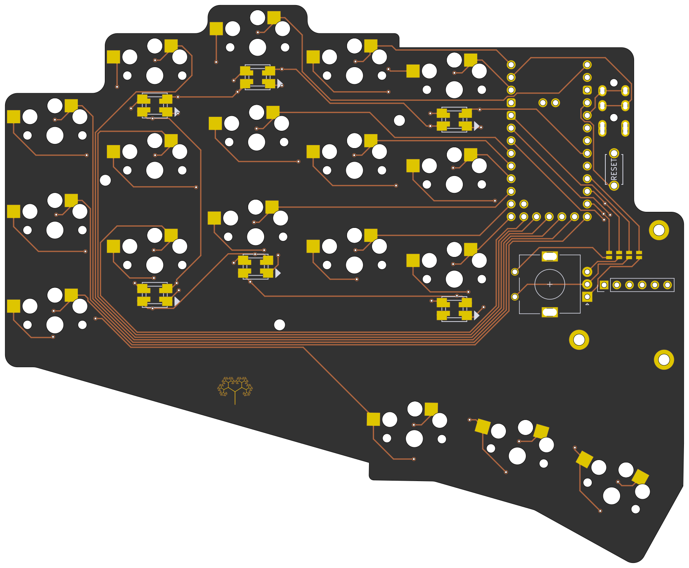
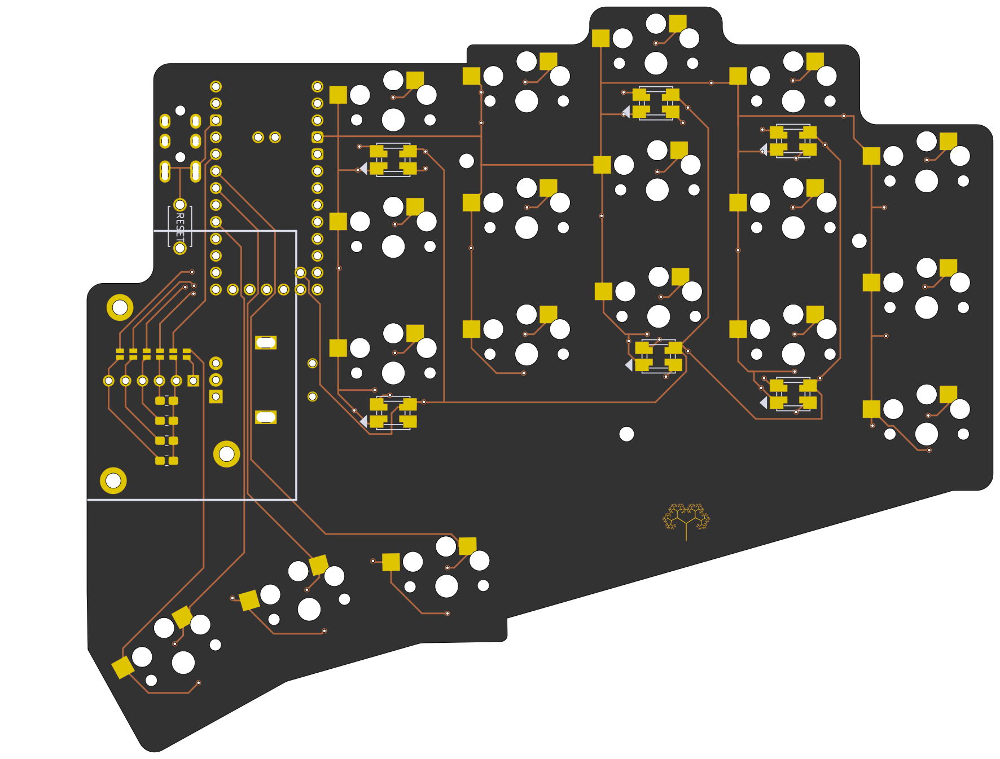

# Ent

## Ergogen generated split keyboard

This fork of [ergogen](https://github.com/linosgian/ergogen/tree/lgian/custom_footprints) is used, which contains all the custom footprints that appear on the board (holes, trackpad, elite-c etc)

left | right
-|-
 | 

## Features

* Support for a [cirque](https://keycapsss.com/keyboard-parts/parts/211/glidepoint-cirque-trackpad-tm040040-tm035035?c=11) and [Azoteq](https://keycapsss.com/keyboard-parts/parts/247/azoteq-proxsense-i2c-touch-sensor-module/capacitive-trackpad) trackpads on the right side (solderable jumpers)
* Support for a rotary encoder on the left side (solderable jumpers)
* Uses elite-c (or equivalent like puchi-c) so more io pins are available
* No diodes (less complexity during soldering)
* Reversible
* Only supports choc v1
